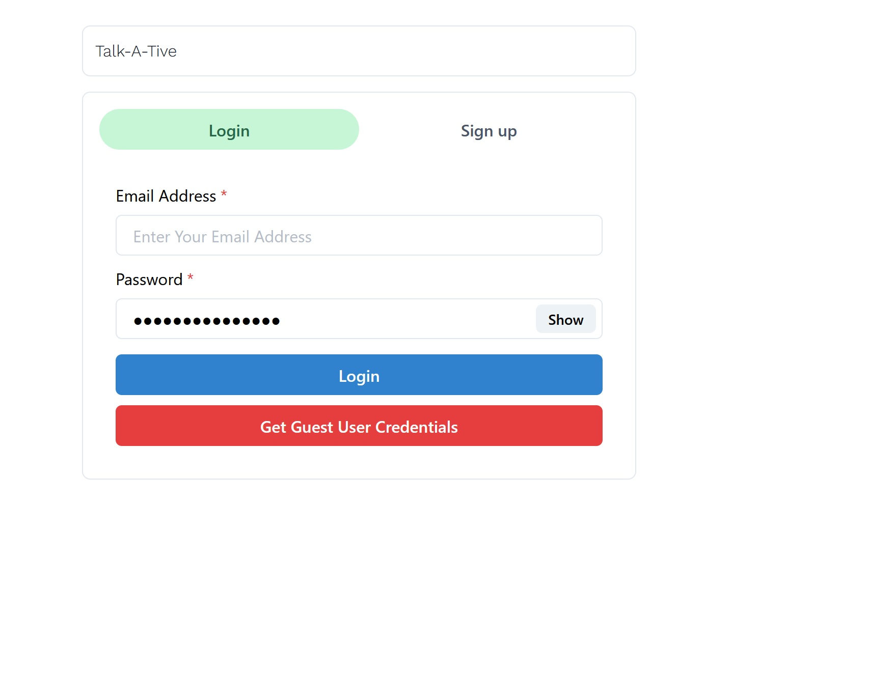
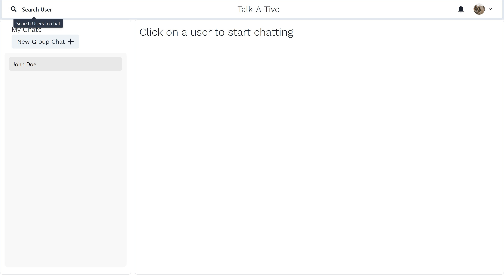
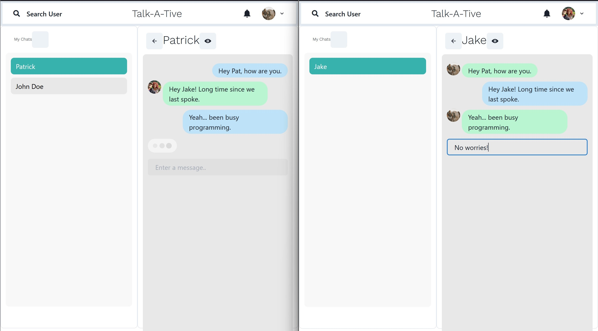

# chat-app-mern
Full Stack chat app that performs real time messaging via Socket.io. App built using MERN (data stored in Mongo DB).

# Application Build
* Client / Frontend: React JS
* Server / Backend: Node JS + Express JS
* Database: Mongo DB

# Features + Screenshots
<h3>Login/Signup<h3>

