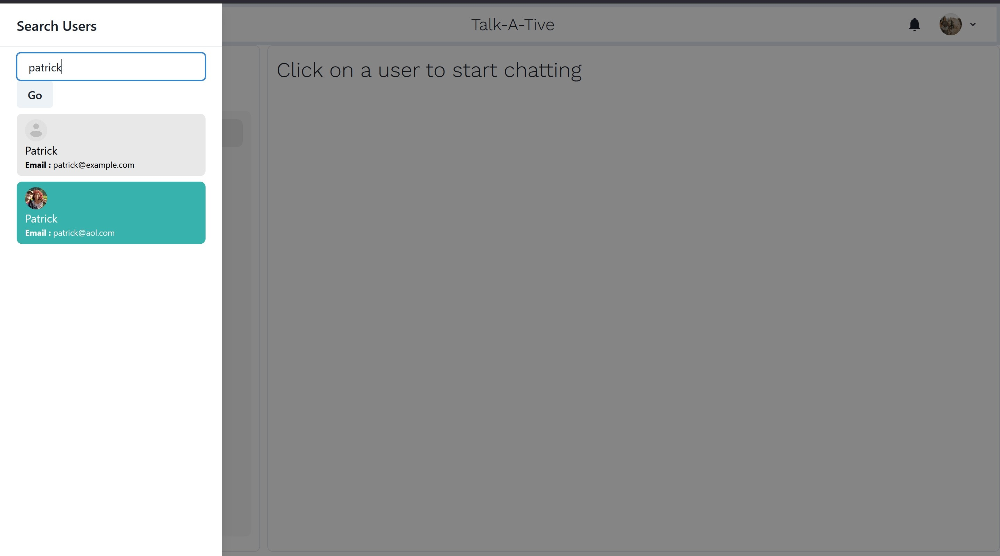

# chat-app-mern
Full Stack chat app that performs real time messaging via Socket.io. App built using MERN (data stored in Mongo DB).

# Application Build
* Client / Frontend: React JS
* Server / Backend: Node JS + Express JS
* Database: Mongo DB

# Features + Screenshots
<h3>Login/Signup</h3>

<h3>Chatpage</h3>

<h3>Search User By Name/Email></h3>

<h3>Real Time Chatting with Typing indicators</h3>

<h3>Notifications for messaging</h3>

